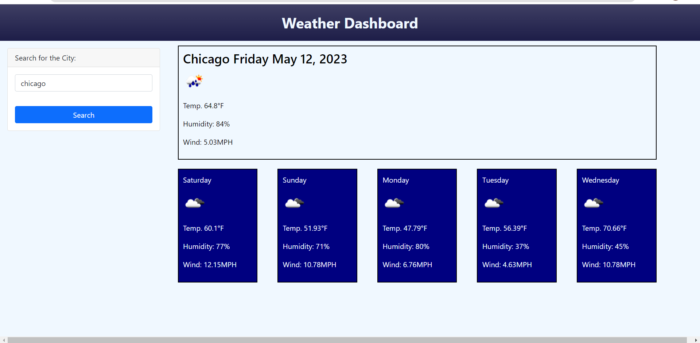
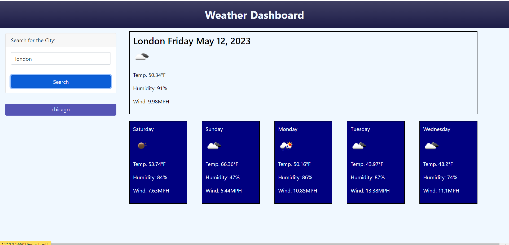

# 06-Weather-Dashboard

## User Story

AS A traveler
I WANT to see the weather outlook for multiple cities
SO THAT I can plan a trip accordingly

## Description

- GIVEN a weather dashboard with form inputs.
- When User searches for a city then he/she is presented with current and future conditions for that city and that city is added to the search history.
- When User views current weather conditions for that city, then User is presented with the city name, the date, an icon representation of weather conditions, the temperature, the humidity, and the the wind speed.
- When User views future weather conditions for that city then he/she is presented with a 5-day forecast that displays the date, an icon representation of weather conditions, the temperature, the wind speed, and the humidity.
- When User clicks on a city in the search history then he/she is again presented with current and future conditions for that city.

## Usage

After clicking the link below User will be presented with the webpage.

https://elenafwork.github.io/06-Weather-Dashboard

  

After searching for the city User will be presented with results:

  

After reloading the webpage and submitting a next search User is able to see the search history and use it for his/her search again:

  

## Credits

 - StackOverflow https://stackoverflow.com/questions/32027935/addeventlistener-is-not-a-function-why-does-this-error-occur
 - YouTube https://www.youtube.com/watch?v=buS3mweBWCA

## License

Please, refer to the repo license.